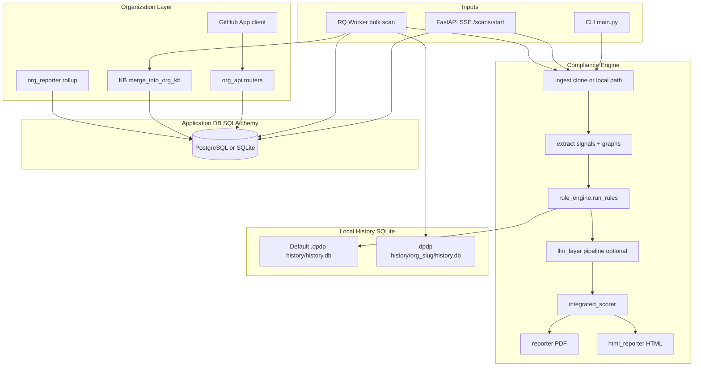

# Compliance Scanner — CEO & Board Platform Briefing

**Document purpose:** Single canonical reference for executives, investors, and engineering leadership: what was built, how it works, what it does *not* promise, and **where the product stands today** (as of the org-wide platform + trust-hardening release on `main`).

**Audience:** CEO, board, heads of product/engineering, customer success, enterprise sales.

**Technical depth:** This document is intentionally granular. Each section can be excerpted for customer-facing material with legal review.

---

## 1. Executive summary

### 1.1 What this product is

**Compliance Scanner** is a **developer-first static analysis and AI-assisted auditing system** focused on the **Digital Personal Data Protection Act, 2023 (DPDP)** of India. It:

- **Ingests** source code (local path, Git URL, or GitHub with appropriate tokens).
- **Extracts** deterministic signals: PII-shaped fields, routes, models, third-party libraries, flow-like paths, import graphs, consent/deletion/retention hints, and more.
- **Runs** a **rule engine** that emits findings (rule id, severity, DPDP-oriented section mapping, evidence pointers).
- Optionally runs a **multi-stage LLM pipeline** (route semantics, gap analysis, skeptic pass, deep compliance review, validated deep findings) to enrich and challenge rule output.
- **Computes** an **integrated numeric score (0–100)** and grade, with **capped** contribution from AI so scores remain defensible.
- **Emits** **PDF** reports, optional **single-file HTML** reports, and persists **scan history** for **delta** comparisons between commits.
- Supports **organization-scale** operation: **GitHub App** installation, **bulk scanning** of many repositories, an **entity-level knowledge base** across repos, and **organization-wide** rollup reports.

### 1.2 What this product is not (important for legal and sales)

- **Not** a law firm, regulator, or substitute for **legal opinion** or **formal certification**.
- **Not** a runtime DPDP enforcement tool in production systems; it is primarily **code-centric** (static + LLM over code context).
- **Not** guaranteed complete coverage of every DPDP obligation in every architecture; gaps exist where rules and models do not see behavior (e.g. policies only in non-code systems, oral processing, undocumented subprocessors).
- **Cross-repo “data flow”** today means **static lineage of named PII-bearing entities and file-level evidence** inferred from code — **not** validated live network tracing between services.

Sales and customer contracts should use language like **“assisted compliance posture signal”** unless you add formal legal review workflows.

### 1.3 Strategic outcome you can message externally

> *“We help engineering and security leaders see DPDP-aligned risk in their **codebase and microservice map** faster, with **explainable findings**, **trend vs last scan**, and **org-wide portfolio** visibility when connecting GitHub at scale.”*

---

## 2. Where we stand now (product maturity snapshot)

Use this table for internal planning and board updates.


| Capability                                        | Status                 | Notes                                                                        |
| ------------------------------------------------- | ---------------------- | ---------------------------------------------------------------------------- |
| **Single-repo CLI scan**                          | **Shipped**            | `main.py`; PDF/HTML optional; `--report-fp` feedback path                    |
| **User auth (email + GitHub OAuth)**              | **Shipped**            | JWT; frontend stores bearer in `localStorage`                                |
| **Web single-repo SSE scan**                      | **Shipped**            | `POST /scans/start`; same engine as CLI                                      |
| **Rule engine + section mapping**                 | **Shipped & hardened** | Soft caps, OSS calibration, suppressions/overrides via repo config           |
| **LLM layers 1–6 style pipeline**                 | **Shipped**            | Integrated score after validation; Gemini stack typical                      |
| **Delta / history (SQLite)**                      | **Shipped**            | Per-repo key; optional **per-org isolation** path for bulk worker            |
| **GitHub Actions DPDP scan**                      | **Shipped**            | Composite action + workflow; PR commentary path                              |
| **Golden / synthetic regression tests**           | **Shipped partial**    | `tests/test_golden_repos.py`, `tests/test_flow_goldens.py`; expand over time |
| **GitHub App org install**                        | **Shipped (backend)**  | Requires **production URL**, **configured App**, and **secrets**             |
| **Bulk scan orchestration**                       | **Shipped**            | RQ when Redis OK; inline thread fallback                                     |
| **Org KB (entities + cross-repo edges)**          | **Shipped v1**         | Heuristic merging; fingerprints reduce false merges                          |
| **Org dashboard / graph UI**                      | **Shipped v1**         | React + React Flow                                                           |
| **Org-wide PDF/HTML report**                      | **Shipped v1**         | Separate generator from single-repo reporter                                 |
| **Enterprise RBAC**                               | **Minimal**            | `owner/admin/member` on org membership only                                  |
| **Billing / plans enforcement**                   | **Partial**            | `plan` + `bulk_scan_limit` on org; no payment integration                    |
| **SOC2 / SSO / SAML**                             | **Not shipped**        | Roadmap dependency for large enterprise                                      |
| **Multi-cloud GitLab/Azure DevOps**               | **Not shipped**        | GitHub-centric today for org features                                        |
| **Formal audit trails for “who suppressed what”** | **Partial**            | YAML suppressions + ack section in PDF; not immutable audit DB               |


**Plain English:** You have a **credible MVP+** for single teams and GitHub-heavy orgs, with a **differentiated org layer** for portfolio scanning. Enterprise procurement will ask for SSO, SLA, DPAs, and evidence packs — budget those as **Phase Enterprise**.

---

## 3. Repository and technology footprint

### 3.1 Monorepo layout (high level)


| Area            | Role                                                                              |
| --------------- | --------------------------------------------------------------------------------- |
| `dpdp_scanner/` | Core engine: ingest, extract, rules, LLM, validation, reporting helpers, KB merge |
| `main.py`       | CLI entry                                                                         |
| `backend/`      | FastAPI API, SQLAlchemy models, org routes, GitHub App client, worker entrypoints |
| `frontend/`     | Vite + React SPA (dashboard, scan, **org pages**)                                 |
| `alembic/`      | Database migrations (org platform tables)                                         |
| `.github/`      | CI workflow + composite action                                                    |
| `tests/`        | pytest suites including golden repos / flow tests                                 |


### 3.2 Primary runtime dependencies (Python)

See `[requirements.txt](../requirements.txt)`. Notable additions for this generation of the platform:

- **alembic** — schema migrations  
- **redis**, **rq** — optional queue for bulk jobs  
- **cryptography**, **python-jose** — JWT and GitHub App signing  
- **google-genai** — LLM  
- **reportlab**, **pyyaml**, **gitpython**, **httpx**, **sqlalchemy**, **fastapi**, **uvicorn**

### 3.3 Frontend dependencies

`[frontend/package.json](../frontend/package.json)`: React 19, React Router 7, **React Flow** for org graphs, lucide-react, framer-motion (auth UX).

---

## 4. Architecture (conceptual)




**Key separation:**

- `**app.db` analogue** (`users`, `organizations`, …) holds **accounts, installs, batches, KB, org reports**.  
- `**.dpdp-history/*.db`** holds **finding-level deltas** and file hashes keyed by `**repo_key`**, optimized for regression and Layer-5-ish delta inputs.

---

## 5. Data model (application database)

All SQLAlchemy modelás live in `[backend/models.py](../backend/models.py)`. Alembic revision `**001_org_platform**` creates/augments tables.

### 5.1 Core user and scan tables (historical)


| Table     | Columns (representative)                                                                                                                              | Purpose                                            |
| --------- | ----------------------------------------------------------------------------------------------------------------------------------------------------- | -------------------------------------------------- |
| **users** | `username`, `email`, `hashed_password?`, `github_id?`, `github_access_token?`, `is_active`, `created_at`                                              | Accounts; OAuth users may omit password            |
| **scans** | `repo_*`, severity counts, `score`, `status`, `report_path`, `**compliance_data` JSON**, `owner_id?`, `**org_id`**, `**repository_id**`, `created_at` | Persisted scan summary for dashboard and downloads |


### 5.2 Organization tenancy


| Table                    | Purpose                                                                                                                                               |
| ------------------------ | ----------------------------------------------------------------------------------------------------------------------------------------------------- |
| **organizations**        | Tenant: `**slug`** (unique), `**display_name**`, `**github_login**`, `**plan**` (`free` default), `**bulk_scan_limit**` (default 100), timestamps     |
| **github_installations** | Links `**installation_id`** (GitHub’s id) → `**organization_id**`; `**account_login**`, `**account_type**` (Organization vs User), `**suspended_at**` |
| **org_memberships**      | `**user_id`** + `**org_id**`, `**role**`: `owner` | `admin` | `member` (unique pair)                                                                  |


### 5.3 Repository catalog (under an organization)

**repositories:** GitHub `**github_repo_id`**, `**full_name**`, branch, `**private**`, `**language**`, `**html_url**`, `**last_scan_at**`, `**last_score**`.

### 5.4 Bulk scanning

**scan_batches:** `org_id`, `requested_by_user_id`, `**status`** (`pending`/`running`/…/`cancelled`), `**scan_mode**` (`fast`  `deep`), `**total**`, `**succeeded**`, `**failed**`, timestamps.

**scan_jobs:** `batch_id`, `repository_id`, optional `**scan_id`** FK after success, `**status**`, `**error**`, `**rq_job_id**`, timestamps.

### 5.5 Knowledge base (cross-repo entity model)

**org_entities:**

- `**canonical_name`** (normalized string cluster key)  
- `**schema_fingerprint**` (nullable hash of inferred field names / schema-ish tokens) — **disambiguates** “two different User models” colliding  
- `**kind`** (defaults toward `data_entity`)  
- Counters `**pii_field_count**`, `**occurrence_count**`  
- `**first_seen_repo_id**`

**org_entity_occurrences:** file paths, optional line, `**role`**: `definition`  `reference`  `consumer`, snippet, `**confidence**`, links to `**scan_id**` optionally.

**org_entity_fields:** per-entity `**field_name`**, `**pii_category**` string, `**seen_in_repos**`.

**cross_repo_edges:** directed `**src_repo_id`** → `**dst_repo_id**` per `**org_entity_id**` and `**edge_type**` (default `definition_consumed`), `**confidence**`, `**evidence_json**` (machine-readable rationale blob).

### 5.6 Organization reports

**org_reports:** `**status`** (`pending`/`running`/…/`failed`), `**pdf_path**`, `**html_path**`, `**summary_json**`, `**error**`, timestamps, `**requested_by_user_id**`.

---

## 6. Backend API catalogue

### 6.1 Core app routes (`[backend/main.py](../backend/main.py)`)


| Method | Path                    | Auth                              | Purpose                                                     |
| ------ | ----------------------- | --------------------------------- | ----------------------------------------------------------- |
| GET    | `/`                     | No                                | Health-ish welcome                                          |
| POST   | `/auth/signup`          | No                                | Creates user                                                |
| POST   | `/auth/login`           | No                                | JWT                                                         |
| GET    | `/auth/github/login`    | No                                | Starts GitHub OAuth (user repos)                            |
| GET    | `/auth/github/callback` | No                                | Completes OAuth, redirects to SPA with JWT                  |
| POST   | `/scans/start`          | Bearer                            | SSE stream; full pipeline; persists `Scan` + SQLite history |
| GET    | `/auth/me`              | Bearer                            | Current user profile                                        |
| GET    | `/scans`                | Bearer                            | User’s scans                                                |
| GET    | `/scans/{id}/report`    | Bearer (+ optional query `token`) | PDF binary                                                  |
| DELETE | `/scans/{id}`           | Bearer                            | Delete scan row                                             |
| GET    | `/dashboard/stats`      | Bearer                            | Aggregate stats for SPA dashboard                           |
| GET    | `/github/repos`         | Bearer                            | User token repo list (`/user/repos` style proxy)            |
| GET    | `/api/health`           | No                                | Load balancer probe                                         |


### 6.2 Organization routes (`/orgs/**`) (`[backend/org_api.py](../backend/org_api.py)`)

Prefix `**/orgs**` on router plus `**GET /github/app/callback**` on separate router (same FastAPI app).


| Method | Path                                           | Guard                    | Purpose                                                                      |
| ------ | ---------------------------------------------- | ------------------------ | ---------------------------------------------------------------------------- |
| GET    | `/orgs/connect`                                | Bearer                   | Redirect to GitHub App install URL (requires App env vars)                   |
| GET    | `/github/app/callback`                         | Public (GitHub redirect) | Create/update org + installation + repos + bootstrap owner membership        |
| GET    | `/orgs`                                        | Bearer                   | List orgs user belongs to (+ role)                                           |
| GET    | `/orgs/{org_id}/dashboard`                     | Bearer + `**X-Org-Id**`  | Org rollup: score-ish average, counts, cross-cutting risks, repo score table |
| POST   | `/orgs/{org_id}/members`                       | Admin/owner              | Add or upgrade member by `**email**` + `**role**`                            |
| GET    | `/orgs/{org_id}/repositories`                  | Member                   | List cached repos (`refresh=true` re-sync from GitHub App installation)      |
| POST   | `/orgs/{org_id}/bulk-scan`                     | Admin/owner              | Create batch + enqueue jobs (**respects bulk_scan_limit**)                   |
| GET    | `/orgs/{org_id}/bulk-scan/{batch_id}`          | Member                   | Batch + job statuses                                                         |
| GET    | `/orgs/{org_id}/bulk-scan/{batch_id}/stream`   | Member                   | SSE-ish poll stream of batch JSON                                            |
| POST   | `/orgs/{org_id}/bulk-scan/{batch_id}/cancel`   | Admin/owner              | Cancel queued/running semantics                                              |
| POST   | `/orgs/{org_id}/bulk-scan/jobs/{job_id}/retry` | Admin/owner              | Re-queue failed job                                                          |
| GET    | `/orgs/{org_id}/entities`                      | Member                   | Paginated KB entity summaries                                                |
| GET    | `/orgs/{org_id}/entities/{entity_id}`          | Member                   | Detail + occurrences                                                         |
| GET    | `/orgs/{org_id}/data-flows`                    | Member                   | Cross-repo edges for graph UI                                                |
| POST   | `/orgs/{org_id}/reports/generate`              | Admin/owner              | Kick async org rollup report                                                 |
| GET    | `/orgs/{org_id}/reports`                       | Member                   | List reports                                                                 |
| GET    | `/orgs/{org_id}/reports/{report_id}`           | Member                   | Download PDF/HTML via `**format`**                                           |


**Corporate note:** Bearer tokens in browser `localStorage` is **acceptable for MVP** but is a **findings topic** for enterprise penetration tests; httpOnly cookie session or BFF pattern is typical hardening later.

---

## 7. GitHub integrations (two mechanisms)

### 7.1 User OAuth (already present)

Stores `**github_access_token`** on `**users**`.

- Used by `**GET /github/repos**` and `**/scans/start**` ingestion when cloning **user-accessible** repos.

### 7.2 GitHub App (organization path)

Configured via environment (see `[.env.example](../.env.example)`):

- `**GITHUB_APP_ID`**
- `**GITHUB_APP_PRIVATE_KEY**` (PKCS1 PEM — often pasted with `\n` escapes into `.env`)
- `**GITHUB_APP_SLUG**` → install URL

Client implementation: `[backend/github_app_client.py](../backend/github_app_client.py)`:

- Builds **JWT** (`RS256`), exchanges for **installation access token**.
- `**list_installation_repos`** paginates `**/installation/repositories**`.

**CEO relevance:** GitHub App is the **scalable enterprise pattern**: org admin installs once; repo access aligns with GitHub RBAC rather than scraping every developer’s PAT.

---

## 8. Job execution — single scan vs bulk

### 8.1 Single-scan (web)

`/scans/start` runs asynchronously in-request via **SSE** streaming; heavy work lifted with `**run_in_threadpool`**. Blocking for long durations on one HTTP connection — acceptable for demos; production may eventually move identical path to queued jobs too.

### 8.2 Bulk scan (organization)

`[backend/workers/scan_runner.py](../backend/workers/scan_runner.py)` `**run_scan_job**`:

1. Resolves Org + Installation → **installation token**
2. `**ingest(target, github_token=...)`** clones
3. Full pipeline (**extract → classify routes → rules → llm_pipeline → pdf → save_scan**)
4. Upserts Postgres `**Scan`** with `**org_id**`, `**repository_id**`
5. Calls `**merge_into_org_kb**`
6. Sets `**repository.last_scan_at**`, `**last_score**`
7. Updates batch counters

Queue layer: `[backend/queue.py](../backend/queue.py)`:

- `**REDIS_URL` ping succeeds** → **RQ** enqueue.
- Else → `**ThreadPoolExecutor`** (`**DPDP_INLINE_WORKERS**`, default 4 worker threads in-process).

**CEO relevance:** Redis is optional for POC; Redis + separate worker containers is recommended for production load.

---

## 9. Scan history and delta semantics

SQLite module `**dpdp_scanner/scan_history.py`** persists:

**scans**, **findings** (finding_key, severity, timestamps, lifecycle), **file_hashes**.

**Purpose:** Enables **incremental cognition** (“what changed since last scan?”) for narratives and selective LLM work.

Org worker calls `**set_db_path(.dpdp-history/<slug>/history.db)`** — **portfolio isolation**.

---

## 10. Repo-level configuration (.dpdp.yml)

`[dpdp_scanner/config.py](../dpdp_scanner/config.py)` loads `**load_config(repo_path)`**.

Capabilities for customers:

- **Suppress** specific findings transparently (**acknowledged** section in PDF)  
- **Override** severity / confidence selectively  
- **Force** `**deployment_class`** when auto inference wrong

This is **critical for enterprise sales cycles** (“we formally accept this backlog item”).

---

## 11. Compliance engine detail (deterministic core)

### 11.1 Ingest (`[dpdp_scanner/ingestor.py](../dpdp_scanner/ingestor.py)`)

Supports URL clone (with retries / shallow clone / HTTP tuning on unstable networks).

### 11.2 Extract (`[dpdp_scanner/extractor.py](../dpdp_scanner/extractor.py)`)

Outputs heterogeneous dict including (non-exhaustive):

- `**pii_fields`** (paths, directions: collection/display/schema…)  
- **Routes / models / auth / consent / deletion / retention** lists  
- `**import_graph`** (cached under `**.dpdp-history/graph_cache**`)  
- `**pii_flow_graph**` (**sources**, **sinks**, **paths**)  
- `**tech_stack_deterministic`** (**manifest-derived**, fed to LLM as ground truth)  
- `**deployment_class`** (`**saas**` / `**self_hosted_oss**` / `**library**`) — calibrates certain rules  
- `**is_framework_library**`, `**is_micro_app**`, `**files_count**`, `**skipped_files**`  
- `**_file_contents**` (full scanned file bodies for downstream rules — **privacy/storage consideration** internally)

### 11.3 Section mapping (`[dpdp_scanner/section_mapping.py](../dpdp_scanner/section_mapping.py)`)

- `**VALID_DPDP_SECTIONS`** whitelisting  
- Remap (`**closest_valid_section**`) to reduce hallucinated citations  
- Scoring `**score_section_key_from_dpdp**` improvements (tie-break precision)

### 11.4 Rule engine (`[dpdp_scanner/rule_engine.py](../dpdp_scanner/rule_engine.py)`)

Themes:

- **Per-section cumulative penalty caps** (~85%) — avoids single-issue total wipeouts  
- **Section 6 (consent-flow cluster)** nuanced — flow penalties capped with **PASS floor** when benign signals exist  
- **Self-hosted OSS** softening for unrealistic SaaS obligations (e.g., grievance officer expectations) — **ethical positioning:** must be documented externally as heuristic  
- `**scorable`** gating retains interpretability vs noise  
- **Suppressions/overrides pipeline** integrates customer YAML  
- `**load_false_positive_penalties`** from feedback log mildly down-weights noisy rules over aggregate human feedback (**self-improving heuristic**, not statistical proof)

Representative tightened rules modules:


| Module                  | Behavioral upgrade                                                                                                                                                                    |
| ----------------------- | ------------------------------------------------------------------------------------------------------------------------------------------------------------------------------------- |
| `rules/breach.py`       | Avoid false **auth error-handling missing** positives on frameworks that handle globally                                                                                              |
| `rules/cross_border.py` | CAPTCHA/CDN-ish security endpoints without PII payload → lower severity tiers                                                                                                         |
| `rules/audit_trail.py`  | Detect ORM-style audit artifacts (Prisma-ish names) vs naive text                                                                                                                     |
| `rules/security.py`     | Logger context downgrade when internal jobs / redaction cues                                                                                                                          |
| `rules/data_flow.py`    | Multi-signal `**flow_confidence`**, infra intermediate penalties in long chains; **entity kind** distinguishes **data_entity** vs **action_handler** improving deletion lineage stats |


*(Additional rule modules may exist beyond this briefing delta; grep `dpdp_scanner/rules/` for full catalog.)*

### 11.5 LLM layer (`[dpdp_scanner/llm_layer.py](../dpdp_scanner/llm_layer.py)`)

**Conceptual staged pipeline** (marketing can compress to ~6 “layers”):

1. Repo summary / structuring grounded by deterministic stack (**not hallucinated**)
2. Route classification refinement
3. Finding enrichment
4. Gap analyst
5. Skeptic
6. Deep review + synthesized themes
7. **Validator** pass on deep outputs with **illegal section pruning / remapping**

Operational env toggles commonly include `**DPDP_SKIP_DEEP_REVIEW`** for quicker runs.

---

## 12. Integrated scoring (`[dpdp_scanner/validation/integrated_scorer.py](../dpdp_scanner/validation/integrated_scorer.py)`)

- Combines deterministic rule score with validated AI-derived gap pressure.  
- `**MAX_AI_POINT_DELTA**` (**8 points** tier in current codebase) prevents wild swing when LLM hallucinates severity.

**Executive interpretation:** Useful for dashboards; **customers may still disagree** — keep export of **underlying rule score vs integrated components** transparent in payloads / UI.

---

## 13. Reporting

### 13.1 Single-repo PDF (`[dpdp_scanner/reporter.py](../dpdp_scanner/reporter.py)`)

Upgraded for professional consumption:

- **Table of Contents** anchors  
- **Business summary** prose block  
- **Severity × section heat visualization**  
- Grouped findings by **DPDP section** clusters  
- **Acknowledged/suppressed transparency** panel  
- **Confidence explanation** captions  
- Distinguishes **code evidence excerpt** vs **AI observation**

### 13.2 HTML companion (`[dpdp_scanner/html_reporter.py](../dpdp_scanner/html_reporter.py)`)

Single static HTML with UX affordances (**search/filter**, GitHub line links assumptions).

### 13.3 Org rollup (`[dpdp_scanner/org_reporter.py](../dpdp_scanner/org_reporter.py)`)

Generates organizational PDF + simplified HTML rollup aggregating scans + KB glimpses:

1. Exec summary aggregates
2. Repo matrix snapshot
3. Cross-cutting duplicated rules
4. Shared vendor fingerprints (best-effort from stored finding payloads)
5. Entity KB sample
6. Inter-repo textual edge listing

7+8. Narrative remediation + section rollup

---

## 14. Frontend application

### 14.1 Personal mode routes (`[frontend/src/App.jsx](../frontend/src/App.jsx)`)

Classic scan dashboard history reports settings auth callback.

### 14.2 Organization routes

Wrapped with shared layout (`[frontend/src/layouts/DashboardLayout.jsx](../frontend/src/layouts/DashboardLayout.jsx)`) + `**OrgProvider`** (`[frontend/src/contexts/OrgContext.jsx](../frontend/src/contexts/OrgContext.jsx)`):

**Routes:** `**/org`**, `**/org/connect**`, `**/org/repos**`, `**/org/scans**`, `**/org/data-flows**`, `**/org/reports**` (`[frontend/src/pages/org/](../frontend/src/pages/org/)` directory).

`[frontend/src/utils/api.js](../frontend/src/utils/api.js)` attaches `**Authorization**` and `**X-Org-Id**`.

---

## 15. Continuous integration (`[.github/](../.github/)`)

`[actions/dpdp-scan/action.yml](../.github/actions/dpdp-scan/action.yml)` — reusable scanning step emitting artifacts PDF+HTML.

`[workflows/dpdp-scan.yml](../.github/workflows/dpdp-scan.yml)` — PR + manual_dispatch — posts summary comment path for new medium/high deltas.

---

## 16. QA & regression posture

`[tests/test_golden_repos.py](../tests/test_golden_repos.py)` synthetic repo fixtures asserting presence/absence/severity of emblematic behaviors.

`[tests/test_flow_goldens.py](../tests/test_flow_goldens.py)` asserts flow rule expectations.

Markers see `[pytest.ini](../pytest.ini)`.

**Gap:** broaden coverage periodically with anonymized sanitized customer excerpts.

---

## 17. Security & privacy operational notes (internal readiness checklist)

Store / process privately:

- `**GITHUB_APP_PRIVATE_KEY`** — KMS / secret manager in prod  
- `**SECRET_KEY**` — rotate JWT  
- Repo file contents linger in `**_file_contents**` during scan — ephemeral memory profile matters for large repos  
- **Customer code** traverses LLM APIs if layers enabled — contractual **subprocessor disclosure** matters  
- **Tokens in localStorage** SPA pattern — CSP + XSS discipline required

---

## 18. Competitive positioning vignette (CEO narrative)

Traditional GRC spreadsheets ask “did we tick the box?” This platform operationalizes:

> **“Did we unintentionally widen personal data propagation in engineering changes?”**

Unique hooks:

- Repo graph + heuristic cross-service **entity lineage** surfaced at org level  
- **Delta scanning** incentivizes iterative improvement within sprints

---

## 19. Risks register (explicit)


| Risk                                      | Severity | Mitigation direction                                            |
| ----------------------------------------- | -------- | --------------------------------------------------------------- |
| **False negatives** — hidden PII pathways | High     | Expand rules + supervised learning on customer opt-in corpuses  |
| **False positives** erode adoption        | Medium   | Feedback loop YAML + aggregated FP penalties                    |
| **LLM non-determinism**                   | Medium   | Validator + score delta cap + rerun reproducibility disclaimers |
| **GitHub-centric lock-in limits TAM**     | Medium   | Partner strategy for GitLab                                     |
| **Token / secret mishandling in ops**     | High     | Mandatory secret scanning in CI policy                          |
| **Over-claim in sales** sparks liability  | Critical | Controlled external language (“signals / prioritization aide”)  |


---

## 20. Recommended next 90-day roadmap themes (prioritized backlog)

Priorities are non-binding but reflect typical SaaS escalation post-MVP.

1. **Production hardening bucket:** GitHub webhook signature verification toggle, hardened callback URL configs, centralized structured logging (**org slug + job id**)
2. **Observability:** `/orgs/{id}/health`, queue latency metrics (# jobs waiting)
3. **Enterprise identity:** SSO (OIDC SAML bridge) + immutable audit logs for suppression changes
4. **Billing:** Stripe metering on scan minutes / repo count tiers vs static `bulk_scan_limit` alone
5. **Expand golden fixtures** quarterly from anonymized regressions
6. **SOC2-aligned data retention toggle** wiping `_file_contents` persistence after serialization
7. **Worker autoscaling manifests** Helm chart + Redis managed service playbook

---

## 21. Stakeholder Q&A cheatsheet


| Question                           | Short answer                                                                                               |
| ---------------------------------- | ---------------------------------------------------------------------------------------------------------- |
| *Can we claim DPDP certification?* | **No.** Provide posture summaries; legal review required for authoritative claims.                         |
| *GitHub Enterprise Server?*        | Not first-class validated in this readme; roadmap item.                                                    |
| *Air-gapped gov cloud?*            | Needs LLM offload / local LLM integration plan; architecture supports swapping client but not turnkey yet. |
| *How accurate is scoring?*         | Transparent composition; calibrated heuristically — treat as directional until benchmarked academically.   |


---

## 22. Appendix A — Files added or materially expanded (release scope)

Approximate thematic ownership (consult git history `**d06a5da`** for exact line deltas):

Engine & CLI: `dpdp_scanner/*`, `main.py`  
Org platform backend: `backend/models.py`, `backend/org_api.py`, `backend/github_app_client.py`, `backend/queue.py`, `backend/workers/*`, `backend/auth.py`, `backend/main.py`, `backend/schemas.py`  
Migrations & ops: `alembic/*`, `.env.example`, `.gitignore`, `requirements.txt`  
Frontend org UI: `frontend/src/pages/org/*`, `frontend/src/contexts`, `frontend/src/layouts`, `frontend/src/utils/api.js`  
KB merge: `dpdp_scanner/kb/merge.py`  
Org rollup: `dpdp_scanner/org_reporter.py`  
CI: `.github/workflows/dpdp-scan.yml`, `.github/actions/dpdp-scan/action.yml`  
Tests: `tests/test_golden_repos.py`, `pytest.ini`  

---

## 23. Appendix B — How to reproduce a leadership demo locally

Minimal dev path (engineering may adapt):

```bash
copy .env.example .env # fill secrets
set USE_SQLITE=1       # PowerShell convenience
python -m alembic upgrade head
python -m uvicorn backend.main:app --reload --port 8000
python -m backend.workers.run   # optional second terminal if Redis alive
cd frontend && npm install && npm run dev
python main.py https://github.com/<org>/<repo> --output out.pdf  # CLI variant
```

**Org demo:** Requires live **GitHub App** setup + reachable callback URL (**ngrok**/staging subdomain).

---

**Document stewardship:** Maintain this file alongside major releases (`git blame` accountable owner: Head of Platform). Archive dated snapshots under `docs/archive/` quarterly for board decks.